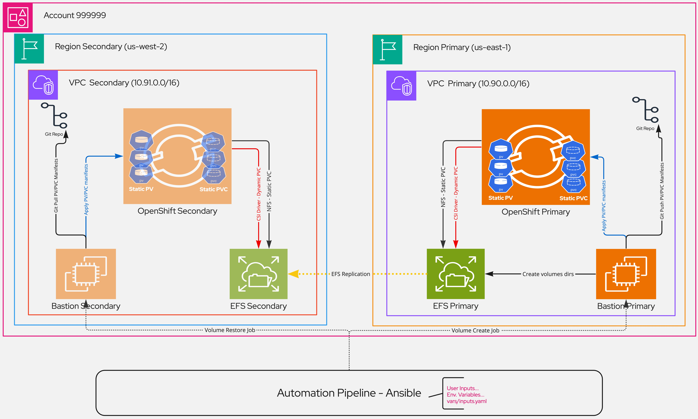

# Application regional disaster recovery using ROSA (OpenShift on AWS) and AWS EFS - An unpopular yet effective approach

## Introduction

Disaster ranges from mistakenly deleting data to an entire cloud region or critical service within that region being down. There are many commercial and freemium solutions offerings around this business need.

In the event of a disaster, one question customers often ask is "How do I make sure business can resume as quickly as possible with the least amount of downtime and data loss".

This article attempts to demonstrate an approach to solving this problem in a manner that is low-cost yet effective; using static volume provisioning with RedHat OpenShift on AWS (ROSA) and AWS EFS. 

The solution works best for workloads with storage performance requirements that can be satisfied with NFS. 

This solution may be applied to any of the following scenarios:

- Data protection
- Application migration
- Data proximity, exposing read-only data to workloads deployed in other regions
- Regional failover due to a region or critical service within that region being down
- Protection from accidental data deletion. For example, a mistake causes the entire storage service or persistent volume to be deleted
- Business continuity wargaming

If you need a refresher on the topic of "Disaster Recovery" in the cloud, I suggest you read [this article](https://aws.amazon.com/what-is/disaster-recovery/) from AWS.

## Solution Overview

We'll discuss the solution in two phases, before and after the disaster.

### Phase I: Pre-Disaster (Disaster Readiness)

During the readiness phase, in conjunction with our RPO and RTO objectives, we develop the fall-back plan that will be executed in the event of a disaster. Keep in mind that such a plan should be periodically tested to identify any cracks that may have been introduced over time due to technology maturity, and life cycle. 

Moreover, in this phase most if not all application deployments and network traffic will be directed at the Primary region.

At a higher level, the procedure would look like this:

1. Provision the primary OpenShift cluster in region A.
2. Provision the secondary OpenShift cluster in region B.
     - This step can wait until a disaster occurs if RPO and RTO allow for the time it takes to provision a new ROSA cluster. 
       - 45 to 60 mins for OpenShift self-managed and ROSA Classic;
       - 15 to 30 mins for ROSA Hosted Control Planes (HCP).
3. Provision EFS Primary in Region A.
     - Apply appropriate SecurityGroup rules to allow NFS traffic from OpenShift-Primary cluster and the bastion/CICD host.
4. Provision EFS Secondary in Region B.
     - Apply appropriate SecurityGroup rules to allow NFS traffic from OpenShift-Secondary cluster and the bastion/CICD host.
5. Enable replication from EFS-Primary to EFS-Secondary.
6. If you intend to enable dynamic volume provisioning as well, [configure](https://cloud.redhat.com/experts/rosa/aws-efs/) the AWS EFS CSI Driver Operator. Keep in mind that dynamic volumes are not supported by this solution.
7. Implement the automation process (ie: Ansible...etc) for tenants (app teams) to request static persistent volumes on OpenShift-Primary.

    The [volume-create](./volume-create.yaml) playbook works as follows:
    - Take in required user inputs: AWS credentials, Git credentials, src_efs_hostname, business_unit, cluster_name, application_name, pvc_name, pvc_size, namespace, ocp_login_command
    - Validate user inputs for character lengths, OpenShift cluster-admin permission, ...etc.
    - Create the volume directory tree as: `/<prefix>/<business_unit>/<cluster_name>/<application_name>/<namespace>/<pvc_name>`.
    - Using the predefined PV/PVC template, replace parameters such as <volume_name>, <volume_namespace>, <volume_nfs_server>, <volume_nfs_path>, and save the output manifest to a directory local to the repository.
    - Apply the PV/PVC manifest to OpenShift-Primary; the namespace will be created if it does not exist.
    - Commit and push the PV/PVC manifest to a git SCM.
      - PV/PVC manifest file path: `<playbook-dir>/PV-PVCs/primary/<business_unit>/<cluster_name>/<application_name>/<namespace>/pv-pvc_<pvc_name>.yaml`
    - Wrap the [volume-create](.ci/volume-create.sh) process into a proper CI pipeline with user inputs provided in the form of job parameters.
8. Implement the automation process (ie: Ansible..etc) for restoring the static volumes on OpenShift-Secondary.

    The [volume-restore](./volume-restore.yaml) playbook works as follows:

     - Take in required user inputs: AWS credentials, Git credentials, src_efs_hostname, dest_efs_hostname, ocp_login_command
     - Stop the EFS replication and wait until EFS-Secondary is write-enabled.
     - Recursively scan the PV-PVCs directory, and list all volume manifests used for OpenShift-Primary; for each persistent-volume manifest, replace the EFS-Primary hostname with that of EFS-Secondary.
     - Apply the secondary PV/PVC manifests on OpenShit-Secondary.
     - Commit the secondary PV/PVC manifests to git SCM.
       - PV/PVC manifest file path: `<playbook-dir>/PV-PVCs/secondary/<business_unit>/<cluster_name>/<application_name>/<namespace>/pv-pvc_<pvc_name>.yaml`
     - Wrap the [volume-restore](.ci/volume-restore.sh) process into a proper CI pipeline with user inputs provided as job parameters.

9. Run [volume-create](.ci/volume-create.sh) pipeline to provision a few persistent volumes on OpenShift-Primary.
10. Deploy a few [sample stateful](./sample-apps/) (with static volumes) on OpenShift-Primary.

### Phase II: Post-Disaster (Disaster Recovery)

In contrast, the recovery phase is when the Secondary region takes over and becomes Primary, applications are redeployed (if not already) and network traffic is rerouted.

At a higher level, the procedure would look like this:

1. Provision OpenShift-Secondary in Region B - If not provisioned already.
2. Integrate OpenShift-Secondary with EFS-Secondary instance - if not done already.

  - Network connectivity verification
  - Enable dynamic volume provisioning as well, [configure](https://cloud.redhat.com/experts/rosa/aws-efs/) the AWS EFS CSI Driver Operator. Keep in mind that dynamic volumes are not supported by this solution.
3. Run the [volume-restore](.ci/volume-restore.sh) pipeline to restore static volumes onto OpenShift-Secondary.

    This process will scan the `<playbook-dir>/PV-PVCs/primary/*` directory, create a corresponding PV/PVC for each manifest found; and save the resulting volume manifests in `<playbook-dir>/PV-PVCs/secondary/*`.

4. Redeploy your applications onto OpenShift-Secondary.
5. Reroute network traffic to the Secondary region.

## Implementation

### Pre-requisites
- AWS Account(s)
- Permission to create and replicate EFS services
- Two ROSA clusters, primary and secondary
- Bastion host with software packages: python3.11, python3.11-pip, ansible, aws-cli-v2, nfs-utils, nmap, unzip, openshift-cli. 

### Procedure

Implementation steps are covered in more detail [here](./Implementation.md).

## Conclusion

We've demonstrated, in the Kubernetes world, how one can achieve regional failover of application state using ROSA, AWS EFS, Static volume provisioning, and Ansible automation. This approach can be taken even further by leveraging Event-Driven Ansible to the mix to remove the need for human intervention in the `volume-create --> volume-restore` cycle.